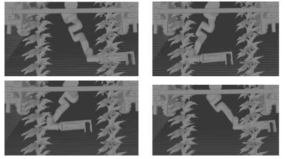
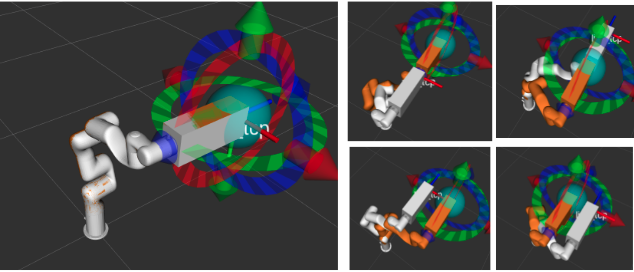

# xArm_Amiga_CMU

# Setup

## Create Amiga model in Gazebo
1. Move model directory to gazebo directory 
```
cd ~/.gazebo/models
mkdir amiga
cd ~/catkin_ws/src/xArm_Amiga_CMU/xarm_gazebo/models
cp -dir amiga/ ~/.gazebo/models/
```

# Running without custom End-Effector
1. Gazebo 
```
roslaunch xarm_gazebo amiga_xarm6.launch
``` 
Error: No p gain specified for pid.  `Namespace: /xarm/gazebo_ros_control/pid_gains/joint is` expected and can be ignored. </br>

2. MoveIt & xArm_Planner 
```
roslaunch xarm6_moveit_config xarm6_moveit_gazebo_plan.launch
```
Manually move the EE in MoveIt GUI and press `Plan & Execute` to move the robot. Both RViz and Gazebo robot arm should move.

3. Python Script for desired Motion using ROS service to MoveGroup Interface
(if first time, make this python script executable)
```
~/catkin_ws/src/xArm_Amiga_CMU/xarm_planner/scripts
chmod +x xArm_planar_motion.py
python xArm_planar_motion.py
```


# Running with custom End-Effector
1. Gazebo 
```
roslaunch xarm_gazebo amiga_xarm6.launch add_gripper:=true
``` 
Error: No p gain specified for pid.  `Namespace: /xarm/gazebo_ros_control/pid_gains/joint is` expected and can be ignored. </br>

2. MoveIt & xArm_Planner 
```
roslaunch xarm6_gripper_moveit_config xarm6_gripper_moveit_gazebo.launch
```
Wait until the terminal prompts `You can start planning now!` message, which means RViz can now take in manual planning requests.
Manually move the EE in MoveIt GUI and press `Plan & Execute` to move the robot. Both RViz and Gazebo robot arm should move. Can manually drag the EE to be in the configuration shown below </br>





3a. Python Script for desired Motion using ROS service to MoveGroup Interface
<span style="color:red">
TODO: Currently, this launch setup does not work with the python script `xArm_planar_motion.py` as it did above. Needs to be resolved to work with MoveGroup script interface. </br>
</span>

3b. Checking MoveIt planning feasibility with custom end-effector. 
Run this separately from previous MoveIt file. The previous `xarm6_gripper_moveit_gazebo.launch` is planning with a smaller EE and NOT the custom EE. The `demo_customEE_gazebo.launch` file accounts for the right dimension of the gripp.er
```
roslaunch xarm6_moveit_config demo_customEE_gazebo.launch 
```

<span style="color:red">
TODO: Currently, this MoveIt launch setup does not work with Gazebo to update the joint angles. Needs to be resolved to work with above Gazebo setup and python script. </br>
</span>


