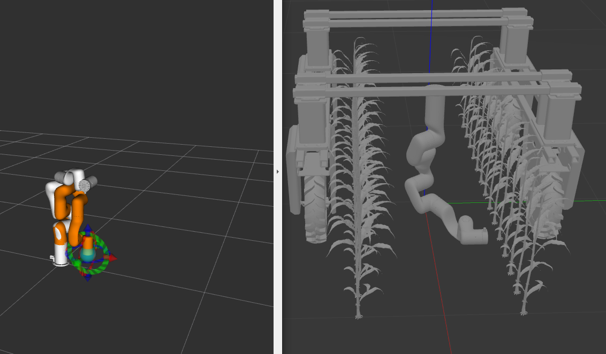

# xArm_Amiga_CMU

# Setup

## Create Amiga model in Gazebo
1. Move model directory to gazebo directory 
```
cd ~/.gazebo/models
mkdir amiga
cd ~/catkin_ws/src/xArm_Amiga_CMU/xarm_gazebo/models
cp -dir amiga/ ~/.gazebo/models/
```

# Running without custom End-Effector
1. Gazebo 
```
roslaunch xarm_gazebo amiga_xarm6.launch
``` 
Error: No p gain specified for pid.  `Namespace: /xarm/gazebo_ros_control/pid_gains/joint is` expected and can be ignored. </br>

2. MoveIt & xArm_Planner 
```
roslaunch xarm6_moveit_config xarm6_moveit_gazebo_plan.launch
```
Manually move the EE in MoveIt GUI and press `Plan & Execute` to move the robot. Both RViz and Gazebo robot arm should move.

3. Python Script for desired Motion using ROS service to MoveGroup Interface
(if first time, make this python script executable)
```
~/catkin_ws/src/xArm_Amiga_CMU/xarm_planner/scripts
chmod +x xArm_planar_motion.py
python xArm_planar_motion.py
```


